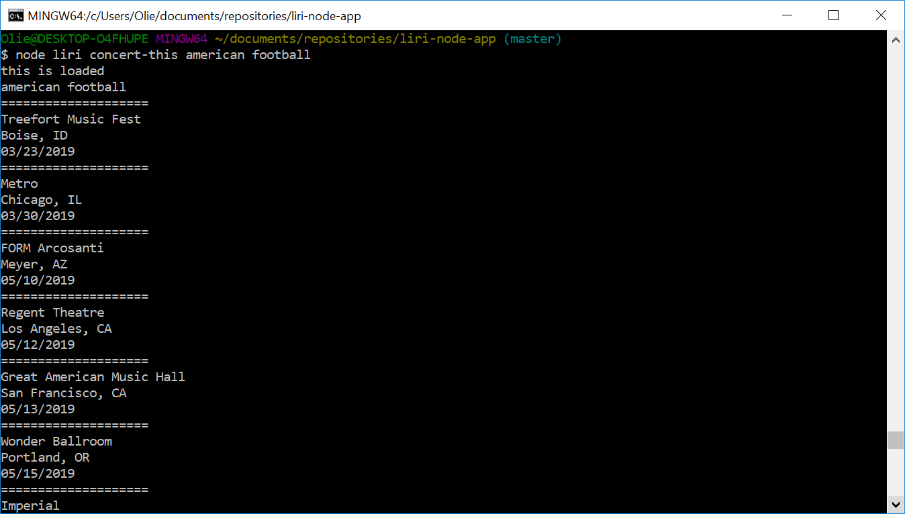
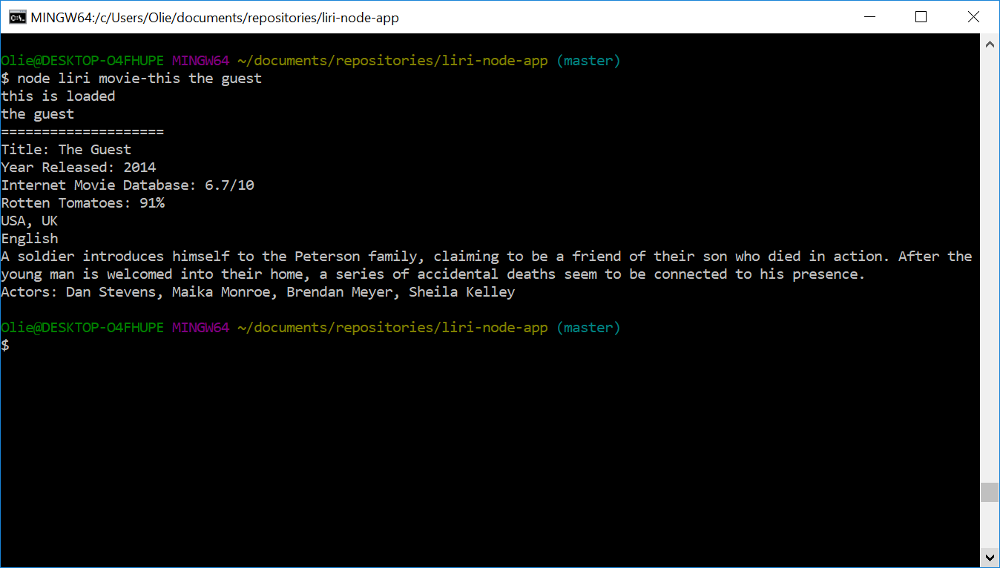
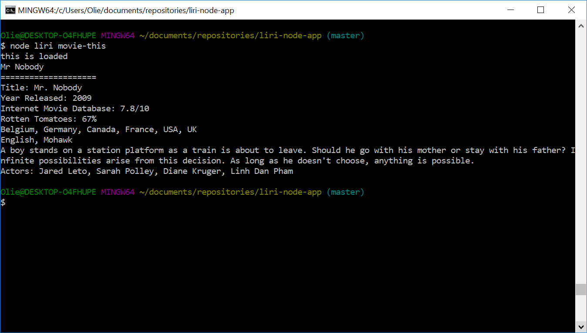
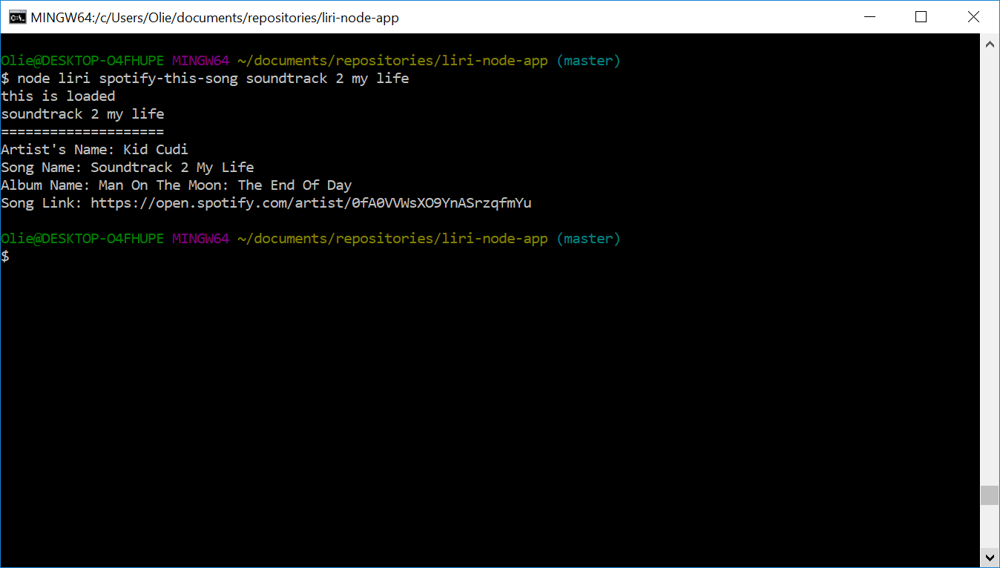
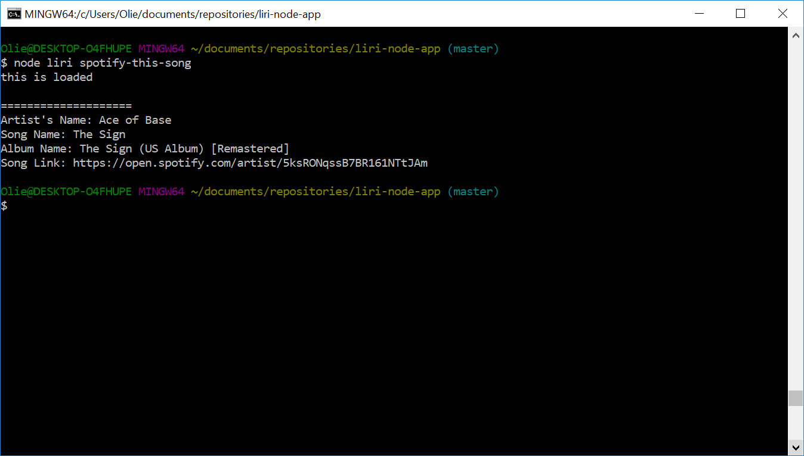
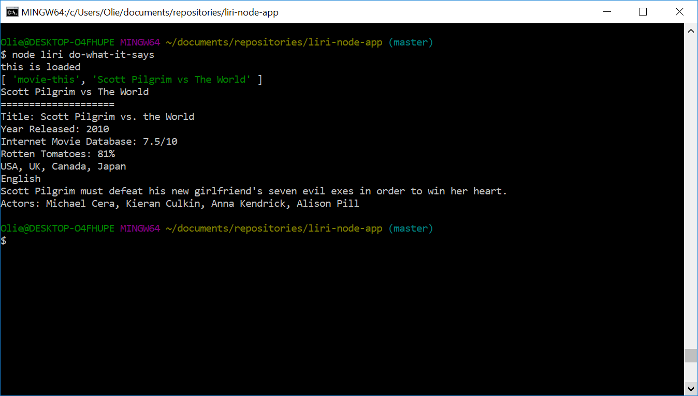

# LIRI
LIRI is a command line application built using Node. 
You will need to provide your own dotenv file with your Spotify API key to run this application.
The API keys you will need:
* Spotify
* BandsInTown
* OMDB

## How it Works
There are four commands you can use:
- concert-this
  - This will output all upcoming shows of the artist/band you search for.
- movie-this
  - This will output info such as year released and plot for the movie you search for.
- spotify-this-song
  - This will output info for the song you search for.
- do-what-it-says
  - This will execute the function (from the 3 above) and search you enter into the random.txt file.

After entering each command, follow it with whatever you want to search for. Below are example screenshots.  
- (If nothing is entered for movie-this, it will default to searching for Mr. Nobody)  
- (If nothing is entered for spotify-this-song, it will default to searching for The Sign by Ace of Base)

> 

> 
> 

> 
> 

> 

## Development
- Axios
- Moment
- DotEnv
- OMDB API
- BandsInTownAPI
- Node Spotify API
